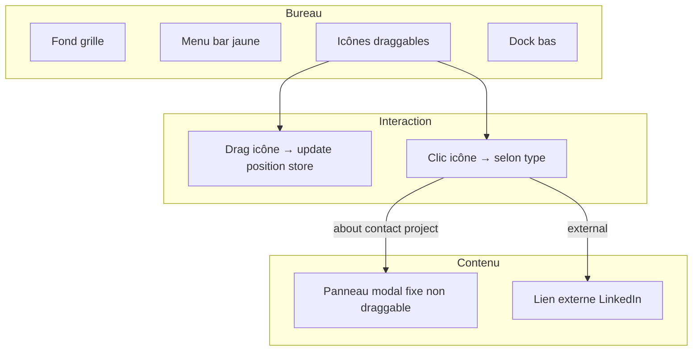

# Plan Technique & Roadmap : Portfolio Rétro OS — Mouhssin RABIHI

Ce document définit la stack technologique et décompose le développement en étapes claires.  
**Référence visuelle :** [marianopascual.me](https://www.marianopascual.me) — bureau rétro illustré, menu haut, dock bas, grille papier millimétré.

---

## 1. Stack Technologique

| Couche | Choix | Rôle |
|---|---|---|
| **Framework** | React + Vite + TypeScript | SPA interactive, composants par application |
| **Styling** | Tailwind CSS + CSS natif | Structure rapide + effets rétro (bordures noires, ombres décalées) |
| **État global** | Zustand | Positions des icônes sur le bureau, application/panneau actif |
| **Drag & Drop** | `react-draggable` ou `@dnd-kit` | **Uniquement pour les icônes du bureau** — pas pour les panneaux de contenu |
| **Typographie** | Helvetica / system-ui | Cohérent avec le style Mariano Pascual |

### Ce qu'on ne fait PAS

- Pas de fenêtres draggables
- Pas de gestion z-index / minimiser / restaurer entre fenêtres
- Pas de taskbar Windows classique (menu haut + dock bas à la place)

---

## 2. Modèle des Applications

Chaque élément du bureau est une **icône déplaçable**. Au clic (double-clic desktop, simple clic mobile), elle déclenche une action selon son **type** :

| Type | Exemple | Comportement au clic |
|---|---|---|
| `about` | About | Ouvre un panneau centré avec ta biographie |
| `contact` | Contact | Ouvre un panneau avec tes coordonnées / formulaire |
| `external` | LinkedIn | Redirige vers une URL externe (`target="_blank"`) |
| `project` | Projet A, Projet B… | Ouvre un panneau avec le détail du projet |

### Structure de données recommandée

```typescript
// src/types/desktop.ts

export type AppType = 'about' | 'contact' | 'external' | 'project'

export interface Position {
  x: number
  y: number
}

export interface DesktopApp {
  id: string
  type: AppType
  title: string
  icon: string              // chemin asset ou clé icône par défaut
  defaultPosition: Position
  position: Position        // position courante (drag)
  url?: string              // pour type 'external' (LinkedIn)
  project?: ProjectDetail   // pour type 'project'
}

export interface ProjectDetail {
  slug: string
  title: string
  shortDescription: string
  longDescription: string
  technologies: string[]
  links?: { label: string; url: string }[]
  image?: string            // optionnel, plus tard
}
```

### Fichiers de configuration

```
src/config/
├── site.ts          # Nom, email, tagline, URL LinkedIn
├── projects.ts      # Liste des projets (1 entrée = 1 icône bureau)
└── desktopApps.ts   # Génère la liste complète des apps (about, contact, linkedin + projets)
```

Les icônes de projets utilisent une **icône par défaut** (dossier générique) en attendant que tu fournisses les assets personnalisés.

---

## 3. Architecture UI



- **Icônes** : `position: absolute`, déplaçables librement sur le bureau (`react-draggable`).
- **Panneau de contenu** : modal/panneau centré, style fenêtre rétro (barre titre + bouton fermer), **non déplaçable**.
- Un seul panneau ouvert à la fois (`activeAppId` dans le store).

---

## 4. Store Zustand (refactor par rapport à l'existant)

Renommer / simplifier `useWindowStore` → **`useDesktopStore`** :

| État | Description |
|---|---|
| `apps: DesktopApp[]` | Toutes les icônes avec leur position |
| `activeAppId: string \| null` | Application dont le panneau est ouvert |

| Action | Description |
|---|---|
| `updateIconPosition(id, x, y)` | Sauvegarde la position après drag |
| `openApp(id)` | Ouvre le panneau (ou déclenche le lien externe) |
| `closeApp()` | Ferme le panneau actif |
| `resetIconPositions()` | Remet les icônes à leur position par défaut (bouton Home du dock) |

**Supprimer** : `minimizeWindow`, `restoreWindow`, `focusWindow`, `maxZIndex`, `openCount`, cascade de fenêtres.

**Persistance optionnelle (étape finitions)** : sauvegarder les positions des icônes dans `localStorage`.

---

## 5. Roadmap — État d'avancement

### Étape 1 — Initialisation & Design global ✅ (fait)

- Projet React + Vite + Tailwind + TypeScript
- Bureau plein écran, fond grille, menu bar jaune, dock, fenêtre d'accueil
- Fichiers : `Desktop.tsx`, `MenuBar.tsx`, `Dock.tsx`, `FeaturedWindow.tsx`, `index.css`

### Étape 2 — Refactor du store ✅ (fait)

- `useDesktopStore` avec modèle `DesktopApp` (types `about`, `contact`, `external`, `project`)
- `activeAppId`, `updateIconPosition`, `openApp`, `closeApp`, `resetIconPositions`
- LinkedIn ouvre l'URL externe directement
- Fichiers : `src/store/useDesktopStore.ts`, `src/types/desktop.ts`, `src/config/`

### Étape 3 — Icônes draggables sur le bureau ✅ (fait)

- Composant `DraggableDesktopIcon.tsx` avec `react-draggable`
- `DesktopIconLayer.tsx` remplace l'ancienne sidebar fixe
- Positions initiales dispersées dans `desktopApps.ts`
- Double-clic (desktop) / simple clic (mobile) pour ouvrir ; drag sans ouverture accidentelle

### Étape 4 — Panneau de contenu (non draggable) ✅ (fait)

- Composant `AppPanel.tsx` : barre titre rétro, bouton ×, zone scrollable
- Lié à `activeAppId` ; fermeture via × ou Escape
- Placeholders par type (`about`, `contact`, `project`) — contenu riche à l'étape 5
- `FeaturedWindow` masquée quand un panneau est ouvert

### Étape 5 — Contenu des applications

| App | Contenu |
|---|---|
| **About** | Texte de présentation, photo optionnelle, compétences |
| **Contact** | Email, téléphone, formulaire ou liens mailto |
| **LinkedIn** | Icône dédiée → redirection vers ton profil |
| **Projets** | 1 icône par projet dans `projects.ts`, panneau détail (description, stack, liens demo/GitHub) |

**Prompt Cursor :**
> Crée AboutPanel, ContactPanel, ProjectPanel. Ajoute les projets dans projects.ts avec icône par défaut. LinkedIn ouvre l'URL externe.

### Étape 6 — Menu bar & Dock

- **Partiellement fait** — à connecter au nouveau store
- Menus File / Contact / Settings → ouvrir les apps correspondantes
- Dock : Home (reset positions + fermer panneau), raccourcis vers About, Contact, LinkedIn

**Prompt Cursor :**
> Connecte MenuBar et Dock à useDesktopStore. Home reset les positions et ferme le panneau actif.

### Étape 7 — Responsive & finitions

- Mobile : panneau plein écran, clic simple sur les icônes
- Désactiver ou adapter le drag sur très petits écrans si nécessaire
- Remplacer les icônes projets par défaut par tes assets personnalisés
- Persistance des positions icônes (`localStorage`)
- Retirer le panneau Dev et la `FeaturedWindow` statique si remplacée

**Prompt Cursor :**
> Ajoute responsive mobile (panneau fullscreen, clic simple). Persiste les positions icônes en localStorage.

---

## 6. Arborescence cible

```
src/
├── components/
│   └── desktop/
│       ├── Desktop.tsx
│       ├── MenuBar.tsx
│       ├── Dock.tsx
│       ├── DraggableDesktopIcon.tsx
│       ├── AppPanel.tsx
│       ├── panels/
│       │   ├── AboutPanel.tsx
│       │   ├── ContactPanel.tsx
│       │   └── ProjectPanel.tsx
│       └── icons/
│           ├── IconDefault.tsx       # icône projet par défaut
│           ├── IconAbout.tsx
│           ├── IconLinkedIn.tsx
│           └── IconMail.tsx
├── config/
│   ├── site.ts
│   ├── projects.ts
│   └── desktopApps.ts
├── store/
│   └── useDesktopStore.ts
├── types/
│   └── desktop.ts
└── hooks/
    └── useClock.ts
```

---

## 7. Prochaine action recommandée

**Étape 5 (contenu des applications)** — créer `AboutPanel`, `ContactPanel`, `ProjectPanel` et remplacer les placeholders de `AppPanel`.

Exemple de contenu initial pour `projects.ts` (à compléter par toi) :

```typescript
export const PROJECTS: ProjectDetail[] = [
  {
    slug: 'mon-projet-1',
    title: 'Mon Projet 1',
    shortDescription: 'Courte description visible sur l\'icône.',
    longDescription: 'Description détaillée affichée dans le panneau.',
    technologies: ['React', 'TypeScript', 'Node.js'],
    links: [{ label: 'GitHub', url: 'https://github.com/...' }],
  },
  // Ajouter un objet par projet → 1 icône bureau générée automatiquement
]
```
